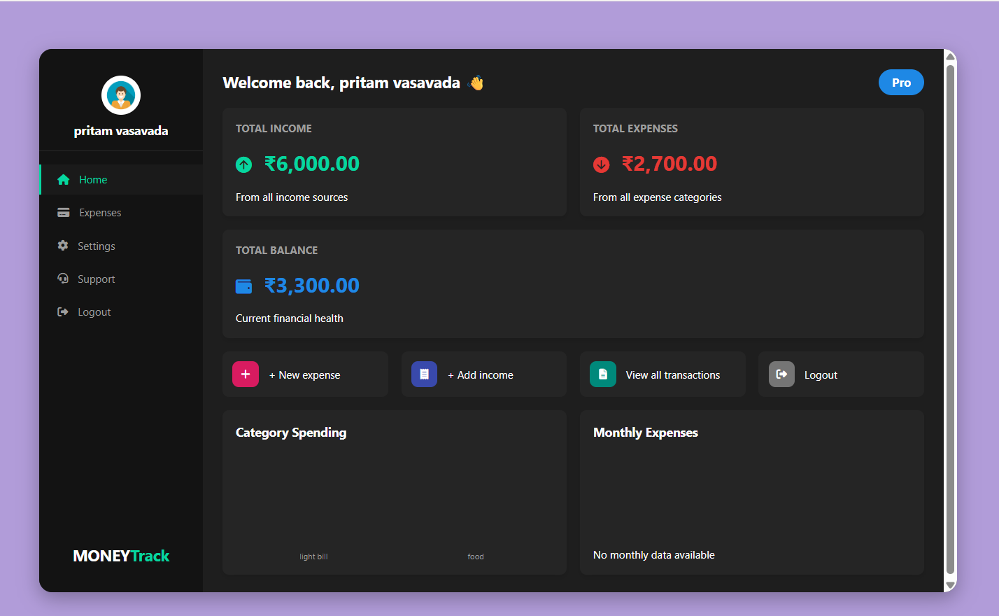
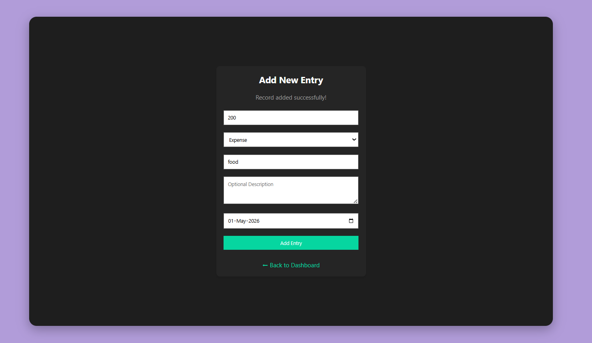
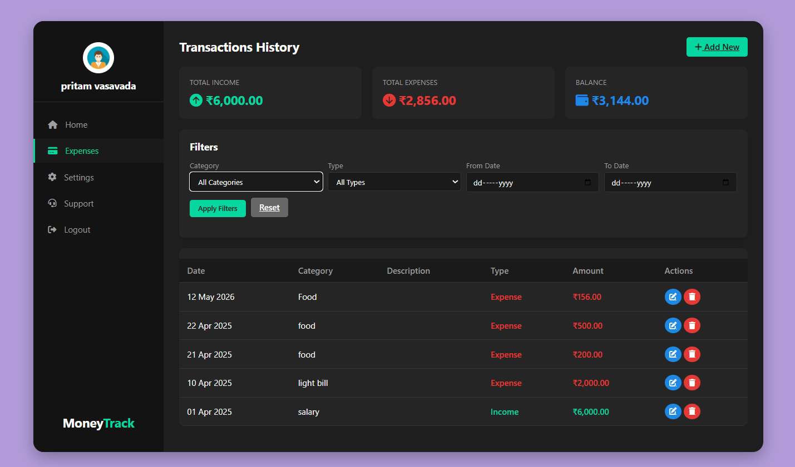
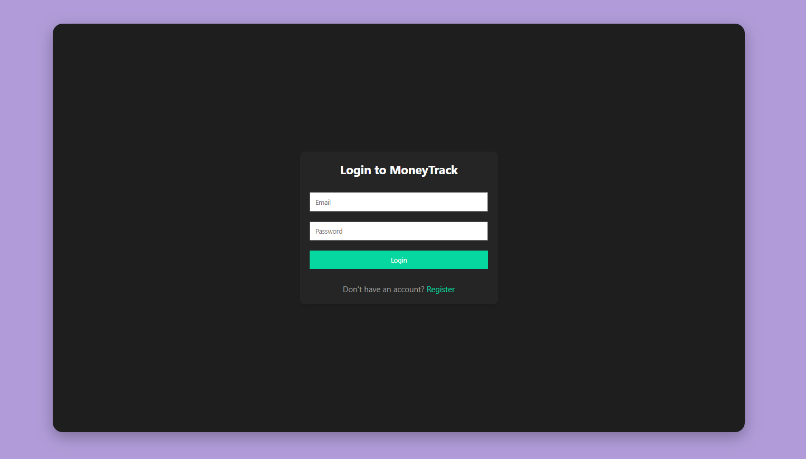

# Expense Tracker System

A simple and responsive Expense Tracker web application developed using PHP and MySQL to manage daily expenses, track spending, and generate reports.

---

## 🚀 Features

* User Login & Authentication
* Add, Edit & Delete Expenses
* Expense Categories
* Dashboard Overview
* Monthly Expense Reports
* Responsive User Interface
* MySQL Database Integration

---

## 🛠 Technologies Used

* PHP
* MySQL
* HTML5
* CSS3
* JavaScript
* Bootstrap
* XAMPP

---

## 📸 Screenshots

### Dashboard



### Add Expense Page



### Expense Report



### Login Page



---

## ⚙️ Installation Guide

### Step 1: Clone Repository

```bash
git clone https://github.com/pritamvasavada/expense-tracker.git
```

### Step 2: Move Project to XAMPP

Move project folder into:

```bash
C:/xampp/htdocs/
```

### Step 3: Start XAMPP

Start:

* Apache
* MySQL

### Step 4: Import Database

1. Open phpMyAdmin
2. Create a new database
3. Import the `.sql` file

### Step 5: Run Project

Open browser:

```bash
http://localhost/expense-tracker
```

---

## 📂 Project Structure

```bash
expense-tracker/
│
├── assets/
├── css/
├── js/
├── screenshots/
├── database/
├── index.php
├── login.php
├── dashboard.php
└── README.md
```

---

## 🎯 Future Improvements

* Export Reports to PDF
* Expense Analytics Charts
* Mobile App Integration
* AI-based Expense Insights
* Dark Mode

---

## 👨‍💻 Author

### Pritam Vasavada

Computer Engineering Student & Full Stack Web Developer

---

## ⭐ Support

If you like this project, give it a star on GitHub.
